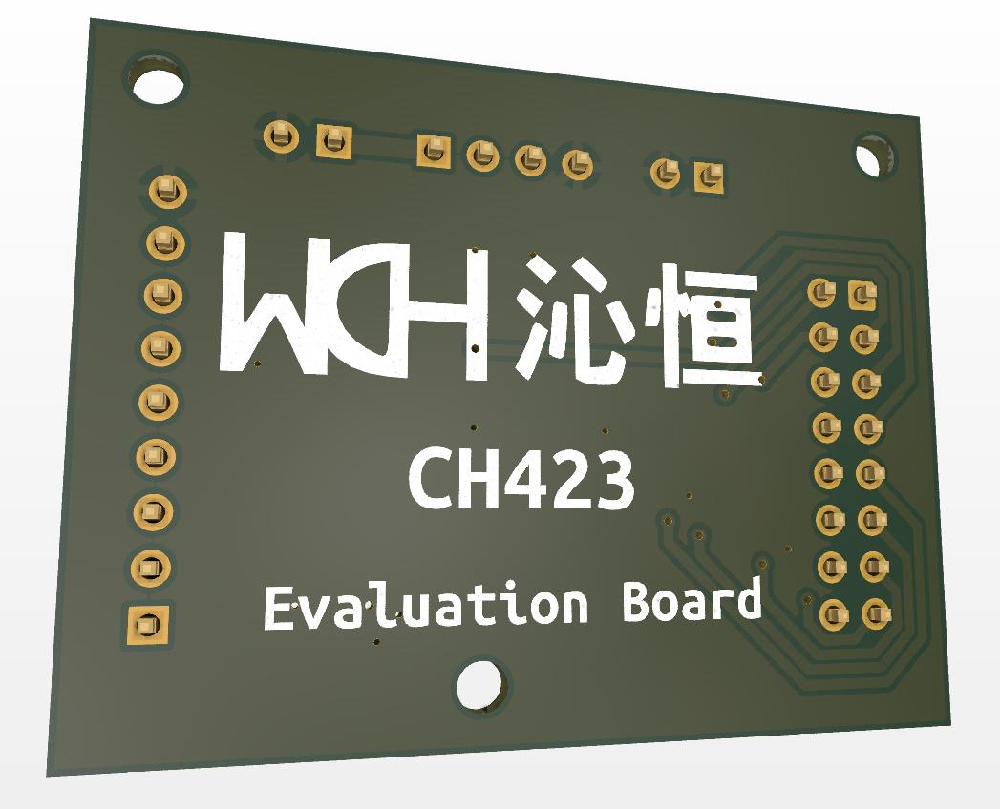

# CH423-Evolution-Board

Evolution board for cost effective I/O expansion operating via 2-wire serial interface.  
It’s great solution for projects based on devices with low pin count. 
Such as ESP8266 /ESP8685.

The evolution board designed for CH423 in SOP28 package: https://www.wch-ic.com/products/CH423.html
 Datasheet: https://github.com/i1-b/CH423-Evolution-Board/blob/main/CH423DS1.PDF
 Or: https://www.wch-ic.com/downloads/CH432DS1_PDF.html

<h2>Overview</h2>

The CH423 is a universal remote I/O expansion chip with a two-wire serial interface. CH423 provides 8 bidirectional input and output pins and 16 general-purpose output pins to support input level change interrupt. CH423 built-in current drive circuit can statically drive 24 LED tubes or dynamically drive 128 LEDs (equivalent to 16 digital) Tube); CH423 exchanges data with a single-chip microcomputer through a 2-wire serial interface. 

<picture>
   
</picture>

<h2>Features</h2>

    • 8 general-purpose input and output pins GPIO and 16 general-purpose output pin GPOs are remotely extended through a two-wire serial interface. 
    • Built-in current drive stage, continuous drive current is not less than 15mA, OC pin output 1/16 pulse sink current is not less than 120mA. 
    • The static display drive mode supports 24 LEDs or 3 LEDs. 
    • The time-sharing dynamic scanning display drive mode supports 128 LEDs or 16-bit common cathode digital tubes, and supports brightness control. 
    • The bidirectional I/O pin has an interrupt function when the input level changes in the input mode, and the interrupt output is active low. 
    • The 16 general-purpose output pins can be selected for push-pull output or open-drain output. 
    • Supports 3V ~ 5V power supply voltage, supports low-power sleep, can be awakened by input level changes. 
    • High-speed 2-wire serial interface with clock speeds from 0 to 1MHz, compatible with two-wire I2C bus, saving pins.

<h2>Schematic</h2>
https://github.com/i1-b/CH423-Evolution-Board/blob/main/CH423_ev.pdf

<h2>PCB Design</h2>

Repository contains: 
<b>/CH423_ev</b>    KiCAD PCB Design Project, including schematic and pcb files.
 <b>/Prod</b>    GERBER files; drl file also included.

<picture>
   
</picture>

<picture>
   
</picture>

<picture>
   
</picture>

<picture>
   
</picture>

<h2>3D model</h2>
https://github.com/i1-b/CH423-Evolution-Board/blob/main/CH423_ev.step

<h2>Library</h2>

Library: https://github.com/Edragon/WCH-CH42X/tree/main/CH423EVT/EXAM

Arduino library: https://github.com/DFRobot/DFRobot_CH423  
It works with I/O expansion only, dynamic scanning display drive mode unimplemented.

